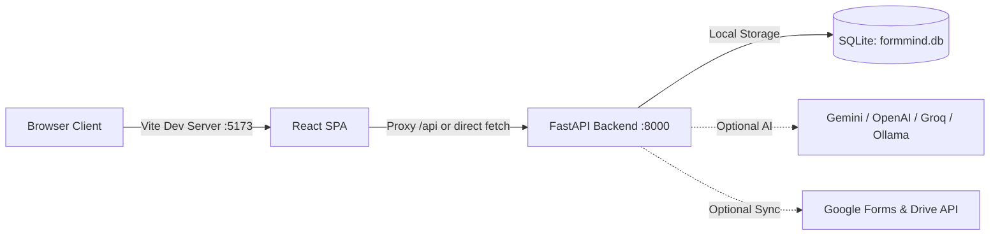

# 🛠️ FormMind AI — Local Testing & Environment Setup Guide

This guide walks you through setting up, configuring, and verifying your local development environment for **FormMind AI**.

---

## ⚡ Quick Start: 30-Second Setup

### 1. Copy Environment Templates

FormMind AI provides ready-to-use template files. Copy the template to create your `.env` file:

#### 🖥️ Windows (PowerShell)
```powershell
# Copy root/backend environment template
Copy-Item .env.example .env

# (Optional) Copy frontend environment template
Copy-Item frontend\.env.example frontend\.env
```

> ⚠️ **Note on PowerShell**: The cmdlet is `Copy-Item` (singular), not `Copy-Items`. You can also use the shorthand alias `cp .env.example .env`.

#### 💻 Windows (Command Prompt)
```cmd
copy .env.example .env
copy frontend\.env.example frontend\.env
```

#### 🐧 macOS / Linux (Bash)
```bash
cp .env.example .env
cp frontend/.env.example frontend/.env
```

---

## 🏗️ Environment Architecture Overview

FormMind AI consists of two components:
1. **Backend (FastAPI)**: Runs on `http://127.0.0.1:8000` and reads `.env` (or `backend/.env`).
2. **Frontend (Vite + React)**: Runs on `http://localhost:5173` and reads `frontend/.env`.



---

## 📋 Complete Environment Variables Reference

| Variable | Default Value | Required? | Category | Description |
| :--- | :--- | :--- | :--- | :--- |
| `ENVIRONMENT` | `development` | No | General | Sets app mode (`development` / `production`). |
| `DEBUG` | `true` | No | General | Enables verbose logging and interactive `/docs`. |
| `LOG_LEVEL` | `INFO` | No | General | Log verbosity: `DEBUG`, `INFO`, `WARNING`, `ERROR`. |
| `SECRET_KEY` | *(dummy dev string)* | No (Local) | Security | Session signing secret key. |
| `ACCESS_TOKEN_EXPIRE_MINUTES` | `10080` | No | Security | JWT token expiration time (7 days). |
| `DATABASE_URL` | `sqlite:///./formmind.db` | No | Database | Database connection string. Uses local SQLite file by default. |
| `CORS_ORIGINS` | `http://localhost:5173,http://127.0.0.1:5173,...` | No | CORS | Comma-separated list of allowed frontend URLs. |
| `RATE_LIMIT_PER_MINUTE` | `180` | No | Protection | Max requests per minute per IP. |
| `MAX_UPLOAD_SIZE_MB` | `50` | No | Protection | Max file upload size in megabytes. |
| `GOOGLE_CLIENT_ID` | `""` | Optional | Google OAuth | Google Cloud OAuth 2.0 Web Client ID. |
| `GOOGLE_CLIENT_SECRET` | `""` | Optional | Google OAuth | Google Cloud OAuth 2.0 Client Secret. |
| `GOOGLE_REDIRECT_URI` | `http://localhost:5173/auth/callback` | Optional | Google OAuth | OAuth redirect callback URI. |
| `VITE_SUPABASE_URL` | `""` | Optional | Supabase | Supabase Project URL (for Supabase Auth). |
| `VITE_SUPABASE_ANON_KEY` | `""` | Optional | Supabase | Supabase Anonymous Public API Key. |
| `VITE_API_BASE_URL` | `http://127.0.0.1:8000/api` | No | Frontend | API URL targeted by the frontend. |
| `VITE_GA_ID` | `G-SPWVNPXRQZ` | Optional | Analytics | Google Analytics 4 Measurement ID. |
| `AI_PROVIDER` | `auto` | No | AI Engine | Active AI engine: `auto`, `gemini`, `openai`, `groq`, `ollama`. |
| `GEMINI_API_KEY` | `""` | Optional | AI Engine | Google Gemini API Key. |
| `OPENAI_API_KEY` | `""` | Optional | AI Engine | OpenAI API Key. |
| `GROQ_API_KEY` | `""` | Optional | AI Engine | Groq API Key (Llama 3, Mixtral). |
| `OLLAMA_BASE_URL` | `http://localhost:11434` | Optional | AI Engine | Local Ollama endpoint for offline LLMs. |

---

## 🧪 4 Local Testing Modes

FormMind AI is designed to be **modular** — you can test all features offline with zero API keys or plug in real cloud services.

### Mode 1: Zero-Config Offline Mode (Default & Recommended for quick tests)
- **Requires**: No external accounts, no API keys, no cloud credentials.
- **AI Engine**: FormMind's built-in **Deterministic Statistical Analysis Engine** generates statistical metrics, sentiment breakdown, themes, and natural language executive summaries locally.
- **Database**: Automatic local `formmind.db` SQLite database.

```env
ENVIRONMENT="development"
DATABASE_URL="sqlite:///./formmind.db"
AI_PROVIDER="auto"
```

---

### Mode 2: Cloud AI Enhanced Mode (Gemini / OpenAI / Groq / Ollama)
If you want LLM-powered conversational chat with your survey data:

#### For Google Gemini:
```env
AI_PROVIDER="gemini"
GEMINI_API_KEY="AIzaSyYourGeminiApiKeyHere"
MODEL_NAME="gemini-1.5-flash"
```

#### For OpenAI:
```env
AI_PROVIDER="openai"
OPENAI_API_KEY="sk-proj-YourOpenAIApiKeyHere"
MODEL_NAME="gpt-4o-mini"
```

#### For Groq (High-Speed Free/Cheap Llama 3):
```env
AI_PROVIDER="groq"
GROQ_API_KEY="gsk_YourGroqApiKeyHere"
MODEL_NAME="llama-3.3-70b-versatile"
```

#### For Local Ollama (100% Private Offline LLM):
```env
AI_PROVIDER="ollama"
OLLAMA_BASE_URL="http://localhost:11434"
MODEL_NAME="llama3.2"
```

---

### Mode 3: Live Google Forms & Drive Sync Mode
To test pulling live forms and responses directly from Google Drive / Google Forms:

1. Go to [Google Cloud Console](https://console.cloud.google.com/apis/credentials).
2. Create an **OAuth 2.0 Client ID** (Application type: **Web application**).
3. Under **Authorized JavaScript origins**, add:
   - `http://localhost:5173`
   - `http://127.0.0.1:5173`
4. Under **Authorized redirect URIs**, add:
   - `http://localhost:5173/auth/callback`
5. Enable the following APIs in **API & Services > Library**:
   - Google Forms API
   - Google Sheets API
   - Google Drive API
6. Add to `.env`:
```env
GOOGLE_CLIENT_ID="your-client-id.apps.googleusercontent.com"
GOOGLE_CLIENT_SECRET="your-client-secret"
GOOGLE_REDIRECT_URI="http://localhost:5173/auth/callback"
```

---

### Mode 4: Supabase Identity Authentication Mode
To test user signup, signin, and avatars via Supabase Auth:

1. Create a project at [supabase.com](https://supabase.com).
2. Copy your Project URL and Anon Key from **Project Settings > API**.
3. Add to `frontend/.env` (or root `.env`):
```env
VITE_SUPABASE_URL="https://xyzcompany.supabase.co"
VITE_SUPABASE_ANON_KEY="eyJhbGciOiJIUzI1NiIsInR5cCI6IkpX..."
```

---

## 🚀 Running Backend & Frontend for Local Testing

### 1. Start the Backend
Open a terminal in the project root:

```bash
# Activate virtual environment if using one (venv\Scripts\activate on Windows)
python main.py
```
*Or using uvicorn directly with hot reload:*
```bash
uvicorn backend.app.main:app --reload --port 8000
```
Backend will be available at: **`http://127.0.0.1:8000`**

### 2. Start the Frontend
Open a second terminal in `frontend/`:

```bash
cd frontend
npm install
npm run dev
```
Frontend will be available at: **`http://localhost:5173`**

---

## 🔍 Verifying Your Local Setup

### 1. Health & Readiness Probes
Run these commands or visit in your browser:
- **Liveness Check**: [http://127.0.0.1:8000/health](http://127.0.0.1:8000/health)
  ```json
  {"status": "ok", "service": "FormMind AI", "version": "1.0.0", "environment": "development"}
  ```
- **Readiness / DB Connectivity**: [http://127.0.0.1:8000/health/ready](http://127.0.0.1:8000/health/ready)
  ```json
  {"status": "ready", "database": "connected", "storage": "ready"}
  ```
- **Interactive Swagger Docs**: [http://127.0.0.1:8000/docs](http://127.0.0.1:8000/docs)

### 2. Run Automated Test Suite
To verify that all backend modules, security handlers, data cleaners, and AI connectors pass:

```bash
# Run all backend tests
pytest backend/tests -v
```

---

## ❓ Troubleshooting & FAQs

### Q1: `Copy-Items : The term 'Copy-Items' is not recognized`
**Fix**: PowerShell command is `Copy-Item` (singular) or simply `cp`:
```powershell
Copy-Item .env.example .env
```

### Q2: Frontend shows "Network Error" or cannot reach `/api`
**Fix**: Ensure the backend is running on `http://127.0.0.1:8000`. The Vite dev server automatically proxies `/api` calls to `http://127.0.0.1:8000`.

### Q3: Google OAuth returns `redirect_uri_mismatch`
**Fix**: Make sure `GOOGLE_REDIRECT_URI` in `.env` is exactly `http://localhost:5173/auth/callback` and that the exact same URL is registered in Google Cloud Console under Authorized Redirect URIs.

### Q4: Database locked error with SQLite
**Fix**: In local development, ensure only one instance of the backend is writing to `formmind.db` at a time. The built-in connection pool handles concurrent requests automatically.
