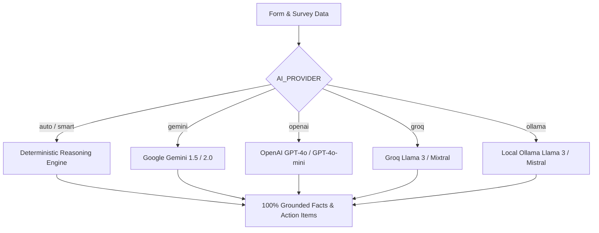

# 🧠 FormMind AI — Intelligent Form Analytics & Grounded Insights Platform

<div align="center">

---

## 🌟 Overview

**FormMind AI** is a full-stack, enterprise-grade survey intelligence platform that bridges the gap between raw data collection and strategic decision-making. Whether handling customer satisfaction (CSAT), employee feedback, academic course evaluations, or market research, FormMind AI ingests form data from multiple sources, runs mathematical cleaning and statistical modeling, and provides a grounded conversational agent alongside presentation-grade visual reports.

### Why FormMind AI?

- **100% Grounded Intelligence**: Never hallucinate survey numbers. FormMind AI combines a **Deterministic Mathematical Engine** with strict RAG validation so every claim cites real respondent data.
- **Universal Ingestion**: Direct integration with Google Forms via OAuth 2.0 / Forms API, Microsoft Forms URL parsing, Google Sheets linking, Excel (.xlsx), CSV, and instant demo datasets.
- **Multi-LLM & Offline Flexibility**: Works out of the box with zero external API costs using the built-in deterministic engine, or connects with Google Gemini, OpenAI (GPT-4o), Groq (Llama 3), or local Ollama instances.
- **One-Click Executive Deliverables**: Generate publication-quality PDF reports, formatted Word documents (.docx), multi-tab Excel workbooks (.xlsx), cleaned CSV files, and visual social/board infographics.

---

## 🚀 Key Features

### 1. 📥 Multi-Channel Ingestion & Data Cleaning

- **Google Cloud OAuth 2.0 Integration**: Browse and sync forms directly from Google Drive with live response synchronization.
- **Public URL Parser**: Ingest public Google Forms and Microsoft Forms structures automatically.
- **File Uploads**: Support for `.csv`, `.xlsx`, and `.xls` survey datasets.
- **Attach Response Sources**: Connect linked Google Sheets or uploaded CSVs to form structures missing response access.
- **Automated Data Cleaner**: Cleans whitespace, handles null values, infers numerical/categorical types, standardizes timestamps, and strips metadata anomalies.

### 2. 📊 Statistical Engine & Analytics

- **Numerical Analysis**: Mean, median, standard deviation, variance, quartiles (Q1, Q3, IQR), min/max, skewness, and polarization scores.
- **Categorical & Likert Distribution**: Mode identification, absolute frequencies, percentage shares, distribution symmetry, and net positive/negative ratios.
- **Text & Sentiment Mining**: Word frequency clouds, common themes, sentiment scoring (positive/neutral/negative), and outlier detection.
- **Segment Comparisons & Cross-Tabulation**: Automated cross-variable correlations (e.g., satisfaction segmented by department or role).

### 3. 💬 Grounded AI Chat Assistant (Zero Hallucinations)

- Natural language query answering over survey data (e.g., *"What was the main complaint among junior staff?"* or *"Compare satisfaction between Q1 and Q2 respondents"*).
- Exact statistical verification against DB counts before returning responses.
- Dynamic filtering, drill-downs, and contextual data citations.

### 4. 📈 Interactive Analytics Dashboard

- **Overview Tab**: High-level KPIs, total responses, completion rates, composite ratings, and key takeaway cards.
- **Questions Tab**: Deep dive into individual question histograms, distributions, and response tables.
- **Responses Tab**: Full responsive data grid with sorting, search, column filters, and raw payload inspect.
- **Charts Tab**: High-resolution interactive charts powered by Chart.js (Bar, Doughnut, Line, Pie, Radar, Polarization).
- **Insights Tab**: Automated SWOT takeaways, statistical highlights, executive observations, and priority action items.
- **Infographic Tab**: Visual summary graphic ready for board presentations or social sharing.
- **Reports Tab**: Customizable report builder with multiple presets (Executive, Comprehensive, Academic, Product Feedback).

### 5. 📑 Multi-Format Export Suite

- **PDF Reports**: Formatted with ReportLab, including executive summaries, statistical tables, and visual breakdown sections.
- **Microsoft Word (.docx)**: Fully editable structured reports with custom typography and data tables.
- **Microsoft Excel (.xlsx)**: Multi-sheet workbooks containing Executive Summary, Cleaned Data, Question Metrics, and Pivot Distributions.
- **Cleaned CSV (.csv)**: Cleaned, machine-readable tabular data.
- **Visual Infographics (.png)**: High-resolution raster visual snapshots.

---

## 🏗️ Architecture

```
FormMindAI-agent/
├── backend/
│   ├── app/
│   │   ├── api/                    # FastAPI route handlers
│   │   │   ├── auth.py             # User auth & Google OAuth 2.0 flow
│   │   │   ├── forms.py            # Form ingestion, sync, and analysis
│   │   │   ├── chat.py             # Grounded chat RAG endpoints
│   │   │   └── exports.py          # PDF, DOCX, XLSX, CSV generation
│   │   ├── models/                 # SQLAlchemy ORM models
│   │   │   ├── user.py, account.py, form.py, question.py
│   │   │   ├── response.py, analysis.py, chat.py, report.py
│   │   ├── schemas/                # Pydantic v2 validation schemas
│   │   ├── services/
│   │   │   ├── ai/                 # Deterministic, Gemini, OpenAI, Groq, Ollama
│   │   │   ├── analytics/          # StatsEngine, TextAnalyzer, ComparativeEngine
│   │   │   ├── chat/               # GroundedChat verification engine
│   │   │   ├── cleaning/           # DataCleaner & type inference
│   │   │   ├── exports/            # PDF, DOCX, XLSX, Infographic generators
│   │   │   └── ingestion/          # Google, Microsoft, File, Demo connectors
│   │   ├── config.py               # Pydantic BaseSettings environment loader
│   │   ├── database.py             # Engine & session management (SQLite / Postgres)
│   │   └── main.py                 # FastAPI application factory & CORS setup
│   ├── requirements.txt            # Python backend dependencies
│   └── tests/                      # Automated test suite (pytest)
│
├── frontend/
│   ├── src/
│   │   ├── components/             # React UI components
│   │   │   ├── Dashboard.jsx       # Main dashboard layout
│   │   │   ├── LandingPage.jsx     # Landing hero & demo selector
│   │   │   ├── Navbar.jsx          # Top navigation & account controls
│   │   │   ├── AnalyzeModal.jsx    # Multi-tab ingestion modal
│   │   │   ├── MyFormsModal.jsx    # Saved forms manager
│   │   │   └── tabs/               # Tabbed analytical views
│   │   │       ├── OverviewTab.jsx, QuestionsTab.jsx, ResponsesTab.jsx
│   │   │       ├── ChartsTab.jsx, InsightsTab.jsx, ReportsTab.jsx
│   │   │       ├── InfographicTab.jsx, AIChatTab.jsx
│   │   ├── context/
│   │   │   ├── AuthContext.jsx     # User & Google account context
│   │   │   └── FormContext.jsx     # Form state, active analysis, and filters
│   │   ├── services/
│   │   │   └── api.js              # Axios-based backend API client
│   │   ├── App.jsx                 # Main application root
│   │   └── index.css               # Tailwind CSS styles & custom tokens
│   ├── package.json                # Frontend dependencies & scripts
│   ├── tailwind.config.js          # Design system & color tokens
│   └── vite.config.js              # Vite bundler configuration
│
└── main.py                         # Root ASGI entrypoint
```

---

## ⚡ Quick Start

### Prerequisites

- **Python 3.10+** (with `pip`)
- **Node.js 18+** (with `npm`)
- *(Optional)* Google Cloud Console credentials for Google Forms API sync

---

### 1. Backend Setup

```bash
# Clone the repository
git clone https://github.com/divyababu374/FormMindAI-agent.git
cd FormMindAI-agent

# Create and activate a virtual environment
python -m venv venv

# On Windows (PowerShell):
.\venv\Scripts\Activate.ps1
# On Linux / macOS:
source venv/bin/activate

# Install dependencies
pip install -r backend/requirements.txt

# Configure environment variables
cp backend/.env.example backend/.env
# Edit backend/.env with your settings (optional API keys)
```

Run the backend server:

```bash
# Option A: From workspace root
python main.py

# Option B: Direct with uvicorn
uvicorn main:app --host 0.0.0.0 --port 8000 --reload
```

The backend API will be available at **`http://localhost:8000`** (Swagger docs at `http://localhost:8000/docs`).

---

### 2. Frontend Setup

In a new terminal window:

```bash
cd FormMindAI-agent/frontend

# Install dependencies
npm install

# Start Vite development server
npm run dev
```

The web dashboard will be running at **`http://localhost:5173`**.

---

## ⚙️ Environment Configuration

Create a `.env` file in `backend/` based on `backend/.env.example`:

| Variable                        | Description                                                                          | Default / Example                             |
| ------------------------------- | ------------------------------------------------------------------------------------ | --------------------------------------------- |
| `PROJECT_NAME`                | Application display name                                                             | `FormMind AI`                               |
| `VERSION`                     | API version                                                                          | `1.0.0`                                     |
| `SECRET_KEY`                  | JWT signing secret key                                                               | `replace-with-a-secure-random-key`          |
| `ACCESS_TOKEN_EXPIRE_MINUTES` | Session token lifetime in minutes                                                    | `10080` (7 days)                            |
| `DATABASE_URL`                | SQLAlchemy connection string                                                         | `sqlite:///./formmind.db`                   |
| `GOOGLE_CLIENT_ID`            | Google OAuth 2.0 Client ID                                                           | `your-client-id.apps.googleusercontent.com` |
| `GOOGLE_CLIENT_SECRET`        | Google OAuth 2.0 Client Secret                                                       | `GOCSPX-your-secret`                        |
| `GOOGLE_REDIRECT_URI`         | OAuth callback URI                                                                   | `http://localhost:5173/auth/callback`       |
| `AI_PROVIDER`                 | Active AI engine (`auto`, `smart`, `gemini`, `openai`, `groq`, `ollama`) | `auto`                                      |
| `GEMINI_API_KEY`              | Google Gemini API Key                                                                | `AIzaSy...` (optional)                      |
| `OPENAI_API_KEY`              | OpenAI API Key                                                                       | `sk-...` (optional)                         |
| `GROQ_API_KEY`                | Groq Cloud API Key                                                                   | `gsk_...` (optional)                        |
| `MODEL_NAME`                  | Custom model override                                                                | *(blank / auto)*                            |
| `OLLAMA_BASE_URL`             | Local Ollama endpoint                                                                | `http://localhost:11434`                    |

---

## 🔐 Google Cloud OAuth Setup

To enable direct Google Forms and Drive syncing:

1. Go to the [Google Cloud Console](https://console.cloud.google.com/).
2. Create a new project (e.g., `FormMind-AI`).
3. Enable the following APIs in **APIs & Services > Library**:
   - **Google Forms API**
   - **Google Drive API**
   - **Google Sheets API**
4. Go to **APIs & Services > OAuth consent screen**:
   - Set User Type to **External** (or Internal for Workspace).
   - Add required scopes:
     - `https://www.googleapis.com/auth/forms.body.readonly`
     - `https://www.googleapis.com/auth/forms.responses.readonly`
     - `https://www.googleapis.com/auth/spreadsheets.readonly`
     - `https://www.googleapis.com/auth/drive.readonly`
     - `openid`, `email`, `profile`
5. Go to **APIs & Services > Credentials** > **Create Credentials > OAuth Client ID**:
   - Application type: **Web application**
   - **Authorized JavaScript origins**: `http://localhost:5173`, `http://localhost:8000`
   - **Authorized redirect URIs**: `http://localhost:5173/auth/callback`
6. Copy the **Client ID** and **Client Secret** into your `backend/.env` file.

---

## 🤖 AI Provider Modes

FormMind AI provides seamless AI provider switching via `AI_PROVIDER`:



- **`auto` / `smart` (Default)**: Uses the internal Python deterministic statistical reasoning engine. Zero API key needed, zero cost, completely offline, zero hallucinations.
- **`gemini`**: Connects to Google's Gemini Flash/Pro models for natural narrative expansion.
- **`openai`**: Connects to GPT-4o / GPT-4o-mini for enterprise summaries.
- **`groq`**: Ultra-fast inference with open-weights models (Llama 3.3 70B).
- **`ollama`**: 100% private, on-premise inference with local LLMs.

---

## 📡 API Endpoints Reference

### 1. Authentication & Google Integration (`/api/auth`)

| Method   | Endpoint                        | Description                             |
| -------- | ------------------------------- | --------------------------------------- |
| `POST` | `/api/auth/register`          | Register a new user account             |
| `POST` | `/api/auth/login`             | Login and retrieve JWT access token     |
| `GET`  | `/api/auth/me`                | Retrieve profile of authenticated user  |
| `GET`  | `/api/auth/google/config`     | Check if Google OAuth is configured     |
| `GET`  | `/api/auth/google/url`        | Generate Google OAuth authorization URL |
| `POST` | `/api/auth/google/callback`   | Exchange OAuth code for tokens          |
| `GET`  | `/api/auth/google/status`     | Check Google account connection status  |
| `POST` | `/api/auth/google/disconnect` | Revoke and disconnect Google account    |

### 2. Forms & Analytics (`/api/forms`)

| Method     | Endpoint                                  | Description                                   |
| ---------- | ----------------------------------------- | --------------------------------------------- |
| `POST`   | `/api/forms/analyze`                    | Ingest and analyze a form (URL or Demo)       |
| `POST`   | `/api/forms/upload`                     | Upload CSV / Excel survey dataset             |
| `GET`    | `/api/forms`                            | List all saved forms for user                 |
| `GET`    | `/api/forms/{form_id}`                  | Get form details, structure, and metadata     |
| `DELETE` | `/api/forms/{form_id}`                  | Delete a form and associated analysis         |
| `GET`    | `/api/forms/{form_id}/questions`        | Get parsed questions and choices              |
| `GET`    | `/api/forms/{form_id}/analysis`         | Get full statistical & AI analysis            |
| `GET`    | `/api/forms/{form_id}/responses`        | Get paginated respondent data                 |
| `GET`    | `/api/forms/{form_id}/data-status`      | Check response availability and access status |
| `POST`   | `/api/forms/{form_id}/sync`             | Trigger live sync with Google Forms API       |
| `POST`   | `/api/forms/{form_id}/attach-sheet`     | Link Google Sheet responses to form structure |
| `POST`   | `/api/forms/{form_id}/upload-responses` | Attach CSV/Excel responses to form structure  |

### 3. Grounded Chat (`/api/chat`)

| Method     | Endpoint                           | Description                                        |
| ---------- | ---------------------------------- | -------------------------------------------------- |
| `POST`   | `/api/chat`                      | Send a query to the zero-hallucination chat engine |
| `GET`    | `/api/chat/history?form_id={id}` | Retrieve chat message history for a form           |
| `DELETE` | `/api/chat/history?form_id={id}` | Clear chat session history                         |

### 4. Exports & Deliverables (`/api/exports`)

| Method       | Endpoint                                  | Description                                    |
| ------------ | ----------------------------------------- | ---------------------------------------------- |
| `POST`     | `/api/exports/report`                   | Generate formatted executive text report       |
| `GET`      | `/api/exports/export/pdf?form_id={id}`  | Download styled PDF report                     |
| `GET`      | `/api/exports/export/docx?form_id={id}` | Download editable Word (.docx) document        |
| `GET`      | `/api/exports/export/xlsx?form_id={id}` | Download multi-sheet Excel (.xlsx) workbook    |
| `GET`      | `/api/exports/export/csv?form_id={id}`  | Download cleaned CSV data                      |
| `GET/POST` | `/api/exports/image`                    | Render and export infographic visual snapshots |

---

## 🧪 Testing

The repository contains an automated test suite covering API contracts, data cleaning, statistical accuracy, export engines, grounded chat responses, and OAuth connectors:

```bash
# Run all backend tests
pytest backend/tests -v

# Run specific test suites
pytest backend/tests/test_api.py -v
pytest backend/tests/test_data_correctness.py -v
pytest backend/tests/test_grounded_chat.py -v
pytest backend/tests/test_exporters.py -v
```

---

## 🚢 Deployment

### Frontend (Vercel)

The frontend includes pre-configured `vercel.json` routing:

1. Connect repository to [Vercel](https://vercel.com).
2. Set root directory to `frontend`.
3. Set environment variable: `VITE_API_URL=https://your-backend-api.com/api`.
4. Deploy!

### Backend (Render / Railway / Docker)

Deploy using standard ASGI servers:

```bash
uvicorn main:app --host 0.0.0.0 --port $PORT
```

Ensure persistent storage or a PostgreSQL database URL is configured via `DATABASE_URL`.

---

## 🛡️ Security & Privacy

- **Data Privacy**: Survey responses are processed locally or through the designated AI provider. No survey data is shared or used for model training.
- **Secure Token Storage**: Google OAuth refresh tokens are securely encrypted and scoped to read-only permissions.
- **Strict Grounding**: The Grounded Chat RAG engine performs deterministic validation to ensure all numerical claims reflect actual dataset responses.

---

## 🤝 Contributing

Contributions, bug reports, and feature requests are welcome!

1. Fork the Project
2. Create your Feature Branch (`git checkout -b feature/AmazingFeature`)
3. Commit your Changes (`git commit -m 'Add some AmazingFeature'`)
4. Push to the Branch (`git push origin feature/AmazingFeature`)
5. Open a Pull Request

---

## 📄 License & Credits

Distributed under the **MIT License**. See `LICENSE` for more information.

Developed and maintained with ❤️ by **[Alzo Tech](https://github.com/divyababu374)**.
